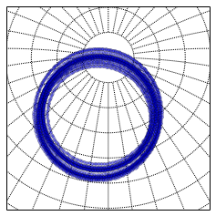

Examples
========

Some basic usage of the Vondrak module.

Periodicity
-----------

This first example, shows the periodicity of ecliptic and equatorial
components of the matrix over 400000 years.

.. code:: python

    %pylab inline

.. parsed-literal::

    Populating the interactive namespace from numpy and matplotlib

.. code:: python

    import vondrak as v
.. code:: python

    ecl_p_matrix_list = []
    equ_p_matrix_list = []
    year = arange(-200001.0, 200000.0, 100)
    for y in year:
        p_ecl = v.ltp_PECL(y)
        p_equ = v.ltp_PEQU(y)
        ecl_p_matrix_list.append(p_ecl)
        equ_p_matrix_list.append(p_equ)
    
    axis([-200000,200000,-.5,1])
    plot(year, ecl_p_matrix_list)
    show()
    axis([-200000,200000,-.8,1.1])
    plot(year, equ_p_matrix_list)
    show()

.. image:: examples_files/examples_3_0.png

.. image:: examples_files/examples_3_1.png

Implementation
--------------

We then will show how to take an initial position (for Polaris) at
J2000, and use the rotation matrix to find the new celestial coordinates
computed for a new epoch.

The new positions (future or past of J2000) are optained by multiplying
the coordinates of the standard epoch by the precession matrix. **p₁** =
**P·p₀**, where **P** is the below precession matrix and **p₀** is the
original position. The precession matrix is unitless.

.. math::

   P = \begin{pmatrix}
   P_{11} & P_{12} & P_{13} \\ 
   P_{21} & P_{22} & P_{23} \\ 
   P_{31} & P_{32} & P_{33} 
   \end{pmatrix}

P is recomputed for every epoch date.

.. math::

   p_{1} = P\cdot p_{0} = \begin{pmatrix}
   P_{11} & P_{12} & P_{13} \\ 
   P_{21} & P_{22} & P_{23} \\ 
   P_{31} & P_{32} & P_{33} 
   \end{pmatrix}
   \begin{pmatrix}
   x\\ y\\ z
   \end{pmatrix}
   =
   \begin{pmatrix}
   P_{11}x + P_{12}y + P_{13}z \\ 
   P_{21}x + P_{22}y + P_{23}z \\ 
   P_{31}x + P_{32}y + P_{33}z 
   \end{pmatrix}

We now have the new celestial coordinates **p₁** expressed in the new
reference epoch. The date is specified in the original computation of
position in J2000 and then maintened when the rotation matrix is
applied.

Additionally, we can convert the coordinates of another epoch to J2000
by inverting the precession matrix. We transpose this like so

.. math::

   P^{-1} = \begin{pmatrix}
   P_{11} & P_{12} & P_{13} \\ 
   P_{21} & P_{22} & P_{23} \\ 
   P_{31} & P_{32} & P_{33} 
   \end{pmatrix}

Polaris
-------

.. code:: python

    def position_matrix(ra=None, dec=None, x=None, y=None, z=None):
        if(ra == None or dec == None):
            ra  = 0.0
            dec = 0.0
        if(x==None or y ==None or z==None):
            x = cos(dec) * cos(ra)
            y = cos(dec) * sin(ra)
            z = sin(dec)
        return array([[x], [y], [z]])
    
    def compute_polaris(year):
        import ephem
        polaris = ephem.star('Polaris')
        polaris.compute(str(year),epoch='2000')
        ra = polaris.a_ra
        dec = polaris.a_dec
        return position_matrix(ra=ra,dec=dec)
.. code:: python

    from ephem import hours as hrs
    from ephem import degrees as deg
    
    p0 = compute_polaris(2000)
    (ra, dec) = v.ra_dec(p0)
    print('RA: {}'.format(hrs(ra)))
    print('DEC: {}'.format(deg(dec)))
    print('cartesian position of Polaris in the year=2000, epoch=2000:')
    x = p0[0][0]
    y = p0[1][0]
    z = p0[2][0]
    print('{}\nthis vector has length {}'.format(
          (x,y,z),sqrt(x*x + y*y + z*z)))

.. parsed-literal::

    RA: 2:31:47.10
    DEC: 89:15:51.0
    cartesian position of Polaris in the year=2000, epoch=2000:
    (0.010127331660770541, 0.007897050033378511, 0.99991753347673784)
    this vector has length 1.0

.. code:: python

    p0 = compute_polaris(2000)
    print('The position of Polaris at J2000 is \n{}'.format(p0))
    epj = 100000
    P = v.ltp_PBMAT(epj) # Precession matrix, GCRS
    p1 = compute_polaris(epj)
    p1 = v.pdp(P, p1)
    print('The new position of Polaris in 100000 years is \n{}'.format(p1))

.. parsed-literal::

    The position of Polaris at J2000 is 
    [[ 0.01012733]
     [ 0.00789705]
     [ 0.99991753]]
    The new position of Polaris in 100000 years is 
    [[ 0.31728427]
     [-0.15847663]
     [ 0.9349951 ]]

.. code:: python

    (ra, dec) = v.ra_dec(p0)
    print('In hours of right ascension and degrees of declination')
    print('The position of Polaris at J2000 is')
    print(str(hrs(ra)),str(deg(dec)))
    print('The new position of Polaris at 100000 years is')
    (ra1, dec1) = v.ra_dec(p1)
    print(str(hrs(ra1)),str(deg(dec1)))

.. parsed-literal::

    In hours of right ascension and degrees of declination
    The position of Polaris at J2000 is
    ('2:31:47.10', '89:15:51.0')
    The new position of Polaris at 100000 years is
    ('-1:46:09.87', '69:13:38.5')

.. code:: python

    from mpl_toolkits.basemap import Basemap
    
    width = 9000000
    bm = Basemap(width=width, height=width, projection='aeqd', 
                 lat_0=70.0, lon_0=280.0)
    bm.drawparallels(np.arange(-80,81,10))
    bm.drawmeridians(np.arange(-180,180,10))
    
    # Position of Polaris at J2000 is p0
    years = arange(-13001, 13000, 100)
    for year in years:
        P = v.ltp_PBMAT(year) # Precession matrix, GCRS
        p_1 = compute_polaris(year)
        p_1 = v.pdp(P, p1)
        (ra1, dec1) = v.ra_dec(p_1)
        x, y = bm(degrees(ra1), degrees(dec1))
        if(year == years[0]):
            bm.plot(x,y, marker='s', color='r')
        elif(year == years[-1]):
            bm.plot(x,y, marker='o', color='b')
        else:
            bm.plot(x,y, marker='.', color='black', markersize=4)
    print('one cycle of precession is ~26 thousand years')

.. parsed-literal::

    one cycle of precession is ~26 thousand years

.. image:: examples_files/examples_9_1.png

.. code:: python

    width = 9000000
    bm = Basemap(width=width, height=width, projection='aeqd', 
                 lat_0=70.0, lon_0=280.0)
    bm.drawparallels(np.arange(-80,81,10))
    bm.drawmeridians(np.arange(-180,180,10))
    
    for year in range(-200001, 200000, 100):
        P = v.ltp_PBMAT(year) # Precession matrix, GCRS
        p_1 = compute_polaris(year)
        p_1 = v.pdp(P, p_1)
        (ra1, dec1) = v.ra_dec(p_1)
        x, y = bm(degrees(ra1), degrees(dec1))
        bm.plot(x,y, marker='o', color='blue', alpha=0.3, ms=3)
    print('here is 400000 years of Polaris\' precession')

.. parsed-literal::

    here is 400000 years of Polaris' precession

